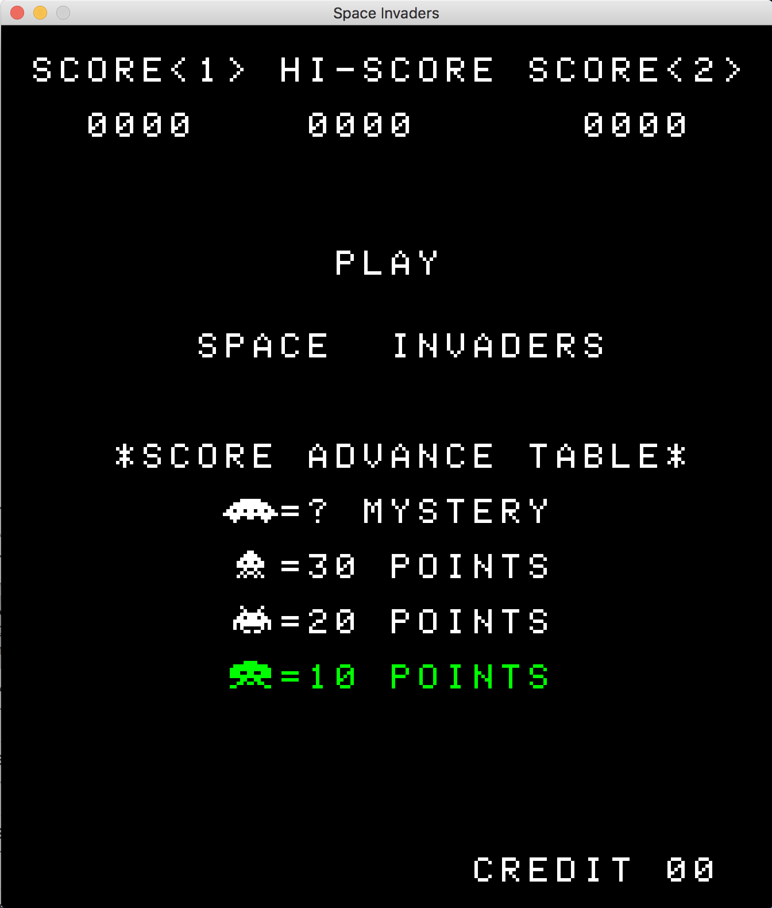
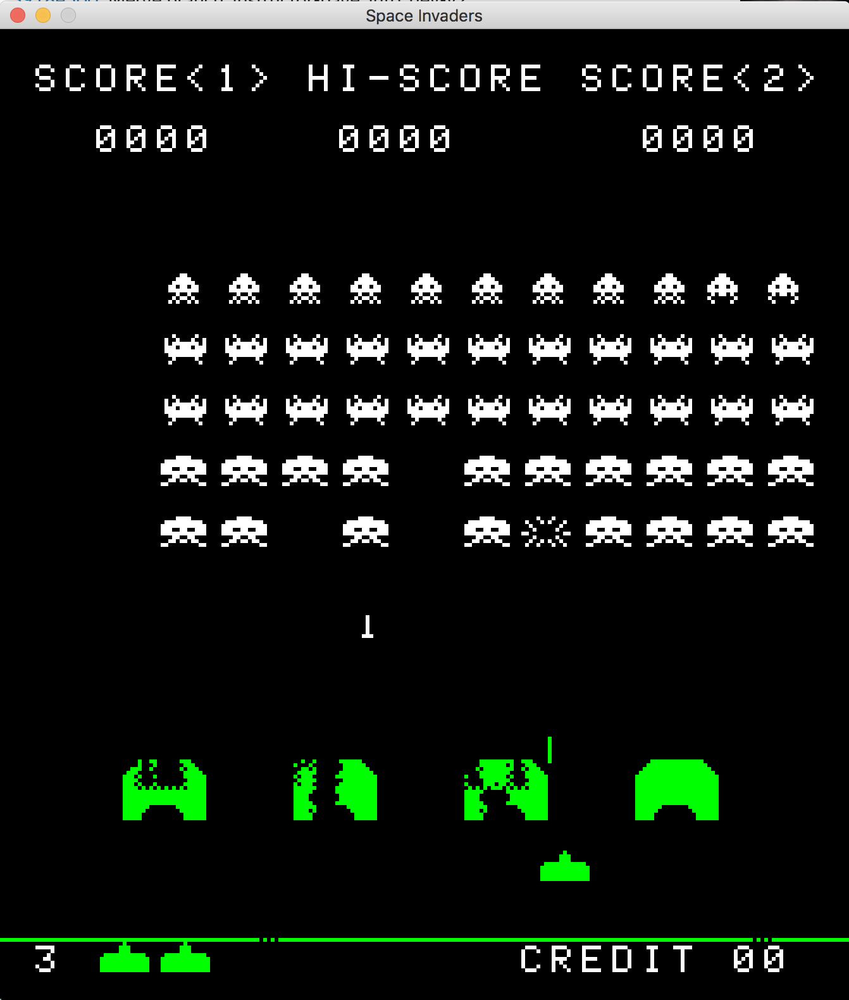

# README

Still working on getting the travis-ci tests working properly.

 

This project is a research project into the emulation of an 8080 chipset. The emulator is functional and currently tied to the game Space Invaders. I have written the emulator entirely in C and made use of the SDL framework for cross-platform compatibility. Any comments or insights are welcome :)

## How to run program

To run the program, clone repository, combine the four invaders files you bought/found into one file called invaders, and put it into the res folder. Next, open the Makefile and replace the path of those SDL2 libraries with the path on your computer. I installed SDL using brew, so the paths should be correct if you do the same. Finally run make and then ./emulator to run the program. This emulator, as of right now, can be run using all operating systems but suffers from unstable framerates in Windows.

## Controls

 * `z`: Player move left
 * `x`: Player move right
 * `.`: Player shoot
 * `c`: Insert coin
 * `1`: Player 1 start button
 * `2`: Player 2 start button

